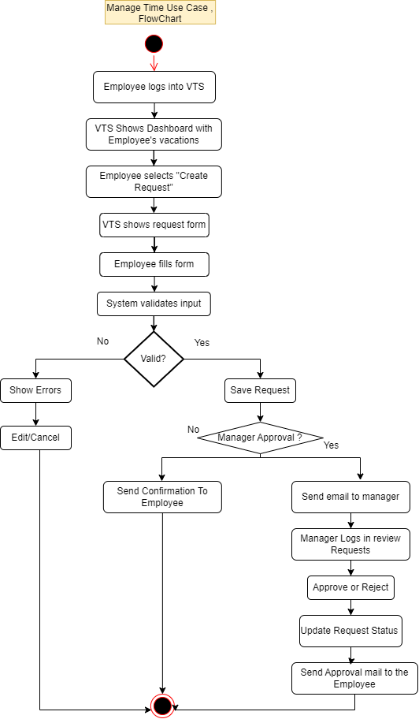
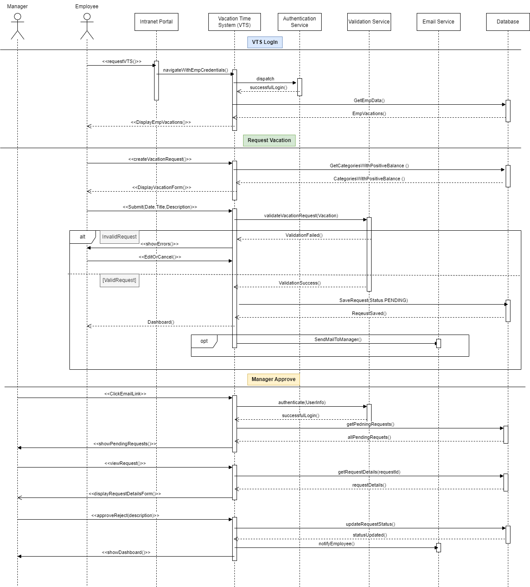

<<<<<<< HEAD
# Vacation Tracking System (VTS)

This repository contains my Object-Oriented Analysis and Design (OOAD) work for a Vacation Tracking System (VTS), based on Chapter 12.

---

## 📌 Project Vision

Vacation Tracking System (VTS) empowers employees to independently manage their vacation time, sick leave, and personal time off. This system is designed to be user-friendly, requiring no in-depth knowledge of company or local leave policies.

The primary goal is to shift responsibility to individual employees, enabling them to take control of this aspect of their employment in a clear, efficient, and self-service manner.

---

## 🧠 Domain (Problem Definition)

The objective of the system is to optimize internal business workflows by automating the approval process for time-off requests.

Previously, the process was manual and time-consuming. The new system will reduce administrative costs and delays by automating routine tasks while preserving control and oversight—especially for HR operations.

---

## 🔧 Functional Requirements

- **Flexible rules-based leave validation** – Validates leave requests using configurable rules.
- **Manager approval functionality** – Enables (optional) approval by managers.
- **Leave request date range support** – Supports leave from the previous year to 1.5 years in the future.
- **Email notifications** – Sends notifications for approvals and status updates.
- **Activity logging** – Logs all user transactions.
- **Override functionality** – HR/Admins can override rule-based actions (with logging).
- **Direct leave awarding by managers** – Managers can directly grant leave within limits.
- **Web service interface** – Allows internal systems to query request summaries.
- **Integration with HR legacy systems** – Syncs with existing HR systems for employee data.

---

## 📈 Non-Functional Requirements

- **Single sign-on authentication** – Uses intranet portal’s SSO.
- **Auditability** – Logs all actions, including overrides.
- **System extension** – Integrates as a part of the existing intranet portal.

---

## ⚠️ Constraints

- **Use of existing hardware/middleware** – Must run on current infrastructure.
- **Portal-based implementation** – Must be part of the intranet portal.
- **Single sign-on only** – No other authentication methods allowed.

---

## 👥 Actors

- **Employee** – Primary user. Manages their own leave.
- **Manager** – Can approve requests and grant compensatory time.
- **HR Clerk** – Manages data. Can add, update, and delete records.
- **System Administrator** – Handles technical stability, server management, and logs.

---

## 📌 Use Case: Manage Time

- Flowchart:  
  

- Sequence Diagram:  
  

- ERD (Entity Relationship Diagram):  
  

---
## 🧾 Pseudocode

📄 [Click here to view pseudocode for "Manage Time"](pseudocode/Use_Case_Manage_Time.md)
=======
