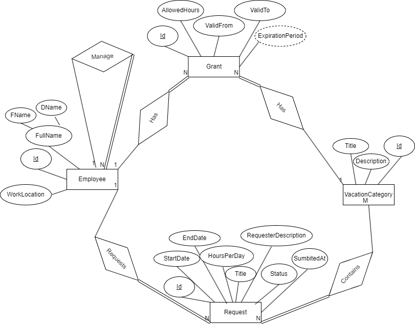

# Vacation Tracking System (VTS) - ERD Version 1

&nbsp;

## 🔍 Overview
This is the initial version of the Entity Relationship Diagram for a  Vacation Tracking System, representing the basic structure for handling vacation requests.

## 📃 Current Design Features
- Simple employee-to-manager relationship
- Basic request status tracking (approve/reject)
- Direct manager approval workflow
- Immediate status updates
- Email notifications on status change

## 💡 Business Logic Flow
1. Employee submits vacation request with details (StartDate, EndDate, HoursPerDay)
2. Request appears in direct manager's dashboard via query:
`SELECT * FROM Request r JOIN Employee e ON r.EmployeeId = e.Id WHERE e.ManagerId = :managerId`
3. Manager takes action (approve/reject)
4. System updates request status
5. Email notification sent to employee

## ↔ Limitations (To Be Addressed in Future Versions)
- No history tracking of status changes
- Single approval point (direct manager only)
- No support for multi-level approvals
- No delegation/substitute functionality
- No SLA/time-bound approval handling
- No escalation rules
- No justification/comment system
- No support for complex approval workflows
- No tracking of response times
- Rigid hierarchy (fails if manager is unavailable)
- No rules based on vacation duration/type

## 🛠 Future Improvements Planned
- Version 2: Add status history tracking
- Version 3: Implement multi-level approvals
- Version 4: Add delegation capabilities
- Version 5: Implement SLA/time-bound rules
> This initial version serves as a foundation that will be enhanced incrementally to address these limitations.